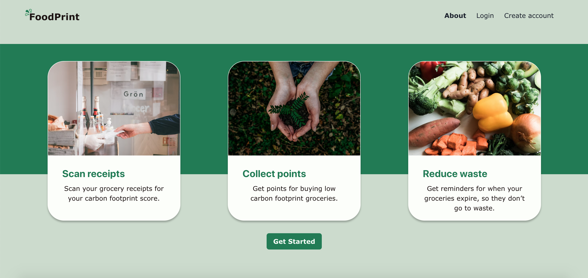
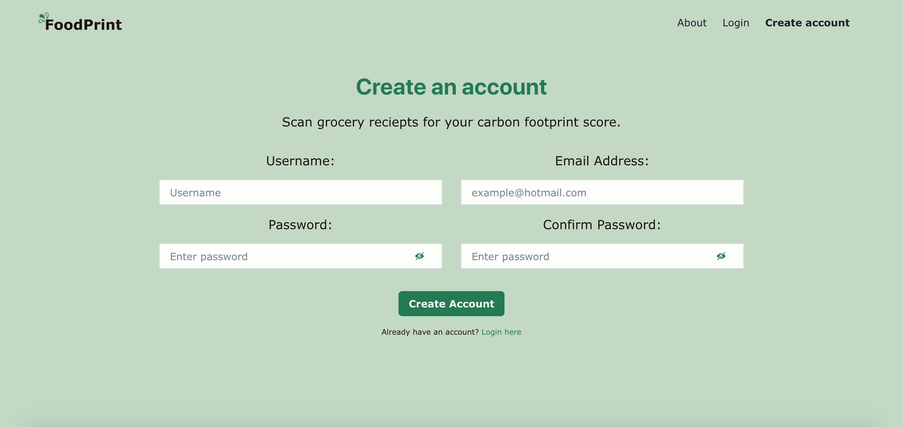
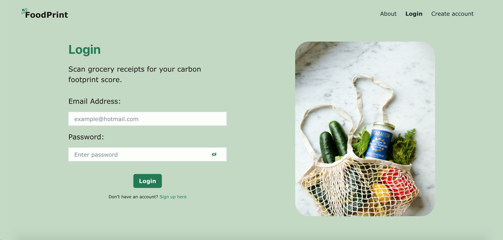
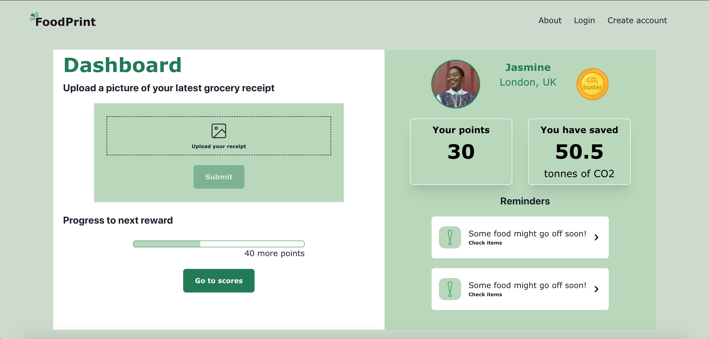
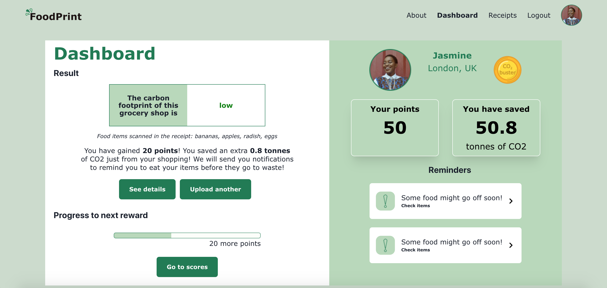
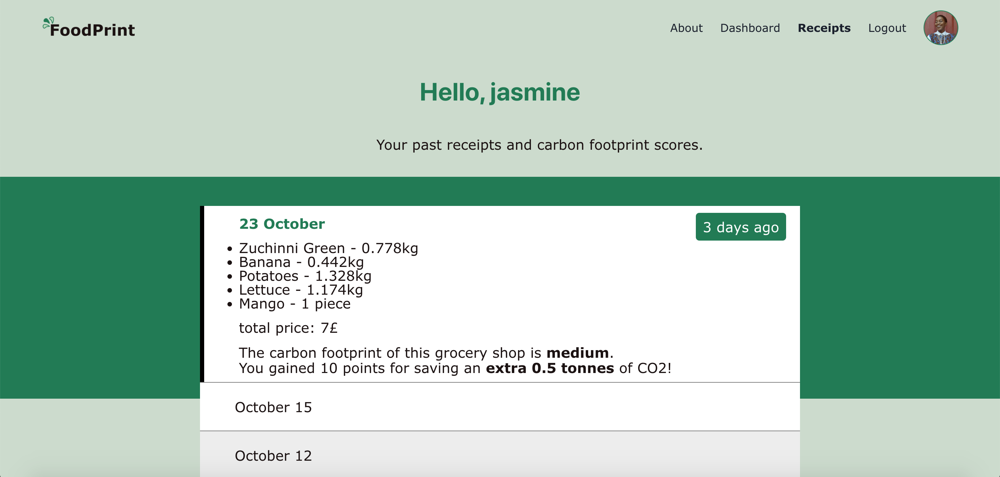

# Athena October 2022 Hackathon - FoodPrint

Our submission for the Athena Hackathon (virtual, October 2022) on the theme "How can households reduce their carbon footprint?".

FoodPrint is a web app that scans food receipts and detects high carbon footprint. The app also sends reminders to avoid food waste, tracks users' previous receipts scans, and uses gamification (with points and special badges) to encourage user engagement.

---> [video presentation](https://youtu.be/Qx8cQ43fTnI)

## App Features
- Scans users’ groceries receipt to calculate the food items’ carbon footprint 
- Sends reminders to users to avoid food waste
- Awards points for low carbon footprint food consumption to encourage users 
- Tracks previous receipts’ scans to help users’ track their impact

We use an OCR API to detect text in the receipt image and take into account the seasonality and type of the food items to calculate their carbon footprint.

We built our app with the security of our users in mind: we use cookie session for authentication and hash users' passwords with bycryptjs before storing them in the database. 

## Future improvements
- Implementing reminders via mobile messaging (SMS, WhatsApp, Telegram)
- Connecting users to local food producers with search and messaging features

## Hackathon 
We met and teamed up for the Hackathon. Working remotely, we had a great time imagining and building this app from scratch in only 35 hours!

## Tech stack
React, Node.js, Express, PostgreSQL, OCR API <br />

## Local installation 

- Clone the repository 

- Install dependencies 
```bash
npm install
```

- Set up a PostgreSQL database:

Set up a PostgreSQL database (download [PostgreSQL](https://www.postgresql.org/download/) if necessary) and add the database credentials in a `.env` file. Once the database is created, connect to your database `psql -d databaseName`, and create the tables in `database.sql`in the backend folder.

- Run a development server:

Concurrently in 2 different tabs:
```bash
npm start
```

```bash
cd client 
npm start
```

## Credits
Audrey (developer), Sowjanya (developer), Kate (developer), Nadia (UI/UX designer), Adeola (UI/UX designer)

## Screenshots 







